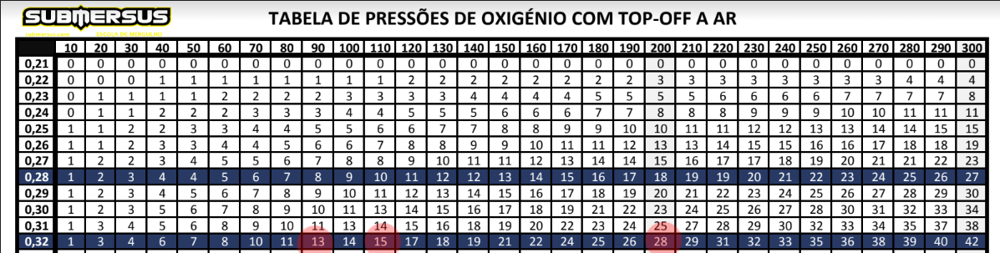
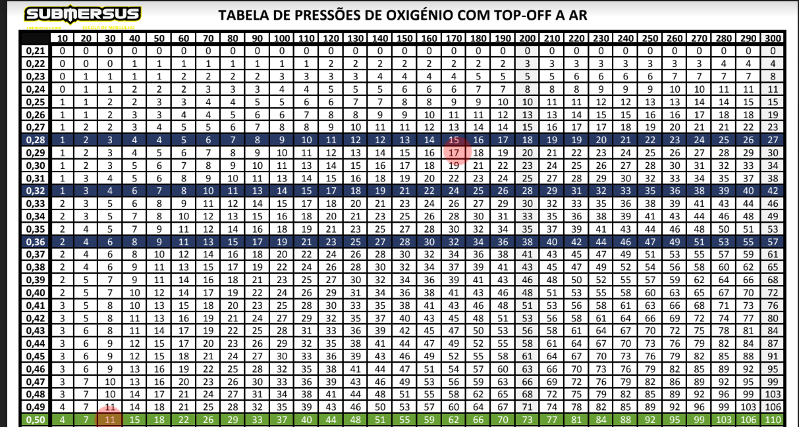
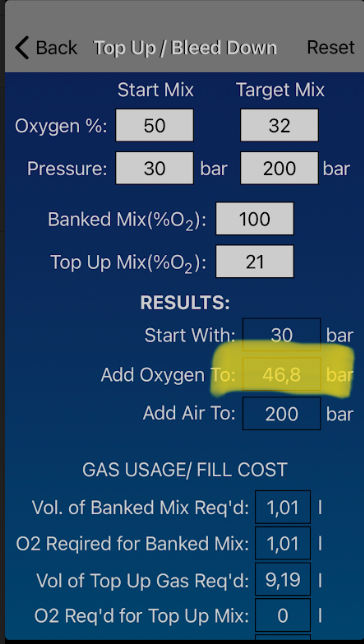

# Nitrox

A FO2 do Nitrox representa o valor em percentagem de O2 numa data mistura.

## Fórmula:  PO2 = Pdesejada * ( (Fdesejada - Ftop-off) / (Fenchimento - Ftop-off) ) , em que:

### PO2 - Pressão de Oxigénio puro no enchimento
### Pdesejada - Pressão final da garrafa pós enchimento
### Fdesejada - Fração oxigénio que queremos obter no produto do enchimento
### Ftop-off - Fração oxigénio presente no gás do top-off (.21 no caso do ar)
### Fenchimento - Fração oxigénio presente no gás do enchimento do oxigénio (1 no caso do oxigénio puro)


## Sabemos também que a pressão total é igual ao somatório das pressões parciais.
Assim: Ptotal = PmixExistente + PmixBlend
### Ptotal - Pressão total no enchimento
### PmixExistente - Pressão do mix existente na garrafa
### PmixBlend - Pressão do mix a fazer blend


### Questão: Como calcular quantos bares de O2 necessários para enchimento de 200 bar EANX 32?
Assumir garrafa com 50 bar ar
Assumir TOP OFF a ar

```
 ---
(   )
|***|
|***|Top-Off a ar
|???|O2 puro a adicionar
|???|
|###|50 bar EAN21
|###|
```

## Resposta requer dois passos:
### 1 - Qual o nitrox a produzir nos 150 bares restantes para o enchimento?
### 2 - Como o fazer?

1 - Qual o nitrox a produzir?
Ptotal = PmixExistente + PmixBlend

200 * 0.32 = 50 * 0.21 + (200-50) X
64 = 10.5 + 150X
-150X = 10.5 - 64
-150X = -53.5
X = -53.5 / -150
X = **0.36, esta é a F02 do nitrox a produzir.**


2 - Como fazer 150 bares de nitrox 36?
PO2 = Pdesejada * ( (Fdesejada - Ftop-off) / (Fenchimento - Ftop-off) )

P02 = 150 * ( (0.36 - 0.21) / (1 - 021) )

PO2 = 150 + ( 0.15 / 0.79)

PO2 = 150 * 0.19

PO2 = **29 bar de O2 seguido de top off a ar.**

Resultado:

```
 ---
(   )
|***|
|***|Top-Off a ar
|+++|29 bar O2
|+++|
|###|50 bar EAN21
|###|
```

### Questão: Como calcular quantos bares de O2 necessários para enchimento de 200 bar EANX 32?
Assumir garrafa com 110 bar EAN32
Assumir TOP OFF a ar

```
 ---
(   )
|***|Top-Off a ar
|???|O2 puro a adicionar
|###|110 bar EAN32
|###|
|###|
|###|
```

## Resposta requer dois passos:
### 1 - Qual o nitrox a produzir nos 90 bares restantes para o enchimento?
### 2 - Como o fazer?

1 - Qual o nitrox a produzir?
Ptotal = PmixExistente + PmixBlend
200 * 0.32 = 110 * 0.32 + (200 - 110) X

64 = 35.2 + 90X

-90X = 35.2 - 64

-90X = -28.8

X = 28.8 / 90

X= **0.32 , esta é a F02 do nitrox a produzir.**

2 - Como fazer 90 bares de nitrox 32?
PO2 = Pdesejada * ( (Fdesejada - Ftop-off) / (Fenchimento - Ftop-off) )

PO2 = 90 * ( (0.32 - 0.21) / (1 - 0.21)) )

PO2 = 90 * ( 0.11 / 0.79 )

PO2 = 90 * 0.14

PO2 = **13 bar de O2 seguido de top off a ar.**

Resultado:

```
 ---
(   )
|***|Top-Off a ar
|+++|13 bar de O2
|###|110 bar EAN32
|###|
|###|
|###|
```

O resultado também pode ser comprovado pela **tabela de pressões de oxigénio com top off a ar** onde:

110 bar de EAN32 existentes são compostos por 15 bar de O2
90 bar de EAN32 são compostos por 13 bar de O2

110 + 90 = 200 que são compostos por 28 bar de O2.



## PRO TIP:
### Temos *14* como um número a decorar em que a cada 100 bar de EAN32, 14 bar de O2


### Questão: Como calcular quantos bares de O2 necessários para enchimento de 200 bar EANX 32?
Assumir garrafa com 30 bar EAN50
Assumir TOP OFF a ar

```
 ---
(   )
|***|Top-Off a ar
|???|O2 puro a adicionar
|???|
|???|
|???|
|###|30 bar de EAN50
```

## Resposta requer dois passos:
### 1 - Qual o nitrox a produzir nos 170 bares restantes para o enchimento?
### 2 - Como o fazer?

1 - Qual o nitrox a produzir?
Ptotal = PmixExistente + PmixBlend

200 * 0.32 =  30 * 0.50 + (200 - 30) X

64 = 15 + 170X

-170X = 15 - 64

-170X = -49

X = -49 / -170

X = **0.29  , esta é a F02 do nitrox a produzir.**


2 - Como fazer 170 bares de nitrox 29?
PO2 = Pdesejada * ( (Fdesejada - Ftop-off) / (Fenchimento - Ftop-off) )

PO2 = 170 * ( (0.29 - 0.21) / ((1 - 0.21)) )

PO2 = 170 * (0.08 / 0.79)

PO2 = 170 * 0.10

PO2 = **17 bar de O2 seguido de top off a ar.**

Resultado:

```
 ---
(   )
|***|Top-Off a ar
|***|
|***|
|***|
|+++|17 bar de O2
|###|30 bar de EAN50
```

O resultado também pode ser comprovado pela **tabela de pressões de oxigénio com top off a ar** onde:

30 bar de EAN50 existentes são compostos por 11 bar de O2
170 bar de EAN29 são compostos por 17 bar de O2

39 + 170 = 200 que são compostos por 28 bar de O2.



